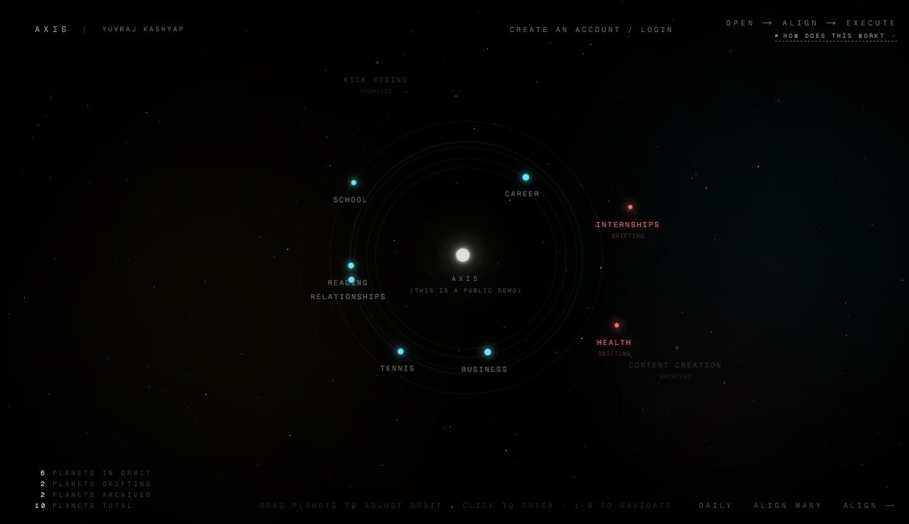
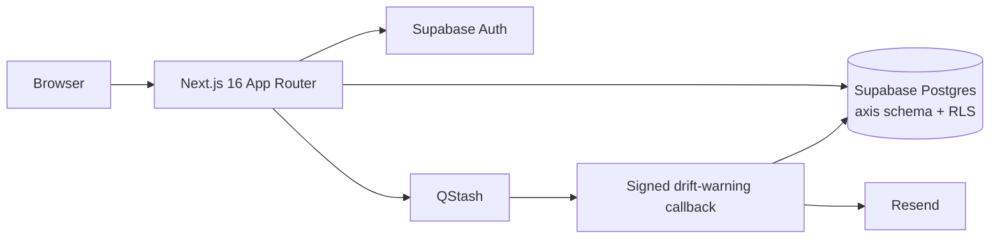

<p align="center">
  
</p>

# Axis

**A spatial personal alignment system for seeing drift, choosing the next move, and getting back to action.**

[Open the live demo](https://axis.yuvrajkashyap.com) · [Read how it works](https://axis.yuvrajkashyap.com/how) · [View the case study](docs/CASE_STUDY.md)

> The homepage is a live, read-only public demo. No account is required to inspect the orrery, domain states, and interaction model. An account unlocks the full editing and commitment workflow.

## Why Axis exists

Most productivity software turns life into a feed, a streak, or an ever-growing task list. Axis takes a narrower position: the product should help someone notice what matters, make one concrete commitment, and leave.

The core loop is deliberately short:

1. **Open** — inspect the system and see what has drifted.
2. **Align** — choose the next concrete action for the domains that matter now.
3. **Execute** — close the app and do the work.

Life domains become planets around a central point. Healthy attention keeps a planet in orbit; neglected domains drift outward; intentionally paused domains remain archived at the edge.

## Product tour

### Orrery

The homepage turns domain state into a spatial interface instead of another dashboard. Planets animate at configurable speeds, accept drag-based orbit changes, expose keyboard navigation, and visually separate aligned, drifting, and archived work.

### Domain alignment

Each domain holds an identity, vision, reason, cost, status, color, drift policy, and a concrete next move. A commitment brings a drifting planet back into the active system.

### Align many

A guided reset can move through several domains in a chosen order. This preserves the product's single-action focus while making a whole-system reset practical.

### Daily execution

The Daily surface connects alignment to execution with weekday checklists, reusable routines, time blocks, linked focus items, subtasks, and per-day routine selection.

### Drift warnings

Per-domain drift thresholds can schedule signed QStash callbacks. Resend delivers warning emails only after the callback re-checks the expected activity state, avoiding stale notifications after a user has already realigned.

## What makes the build interesting

- **A real spatial UI** — the orrery uses DOM transforms and `requestAnimationFrame`, with separate visual states, persisted orbit radii, and responsive mobile/desktop interaction paths.
- **Per-user isolation** — Supabase Auth identifies the user; application queries are scoped by `user_id`; Postgres row-level security adds a second boundary.
- **State derived from time** — effective drift is computed from policy, recent activity, commitment mode, and passive alignment instead of stored as a fragile UI-only flag.
- **Signed asynchronous work** — drift warnings use verified QStash callbacks and revalidation before email delivery.
- **Demo resilience** — production reads a curated public-demo RPC, with a bundled read-only orrery as a graceful fallback during a transient data outage.
- **Incremental schema evolution** — the `sql/` directory captures additive domain settings, subtasks, daily alignment, routine blocks, and RLS policies.

## Architecture



Server Components load user-scoped state. Client Components own animation and high-frequency interaction. Server Actions validate ownership before mutations, then revalidate the affected route.

## Stack

- Next.js 16, React 19, TypeScript
- Tailwind CSS 4 and purpose-built CSS for the orrery
- Supabase Auth, Postgres, RPCs, and row-level security
- Prisma schema tooling for the retained relational model
- QStash for scheduled callbacks
- Resend for transactional email
- Vercel Analytics and Vercel deployment

## Run locally

Requirements: Node.js 22+ and a Supabase project with the Axis schema applied.

```bash
git clone https://github.com/YuvrajKashyap/Axis.git
cd Axis
npm install
cp .env.example .env.local
npm run dev
```

On PowerShell, use `Copy-Item .env.example .env.local` instead of `cp` if needed.

The minimum runtime variables are:

```dotenv
NEXT_PUBLIC_SUPABASE_URL=
NEXT_PUBLIC_SUPABASE_ANON_KEY=
```

`SUPABASE_SERVICE_ROLE_KEY`, QStash, and Resend variables enable privileged auth-email and drift-warning paths. `ADMIN_EMAIL` and `DEMO_USER_ID` enable the curated demo-editing workflow. See [.env.example](.env.example) for the complete list.

## Quality gates

```bash
npm run check
npm run build
```

`npm run check` runs ESLint, TypeScript without emit, and Prisma schema validation. GitHub Actions repeats those checks and performs a clean production build on every push and pull request.

## Repository map

```text
src/app/Orrery.tsx           spatial homepage and interaction model
src/app/domain/[slug]/       domain alignment and settings
src/app/daily/               daily checklists and routine builder
src/lib/drift.ts             effective drift calculation
src/lib/drift-warning.ts     scheduling, verification, and email delivery
src/lib/supabase-*.ts        browser, server, and admin clients
sql/                         Supabase schema evolution and RLS policies
public/showcase/             public-facing product visuals
docs/CASE_STUDY.md           product and engineering decisions
```

## Security notes

- Authenticated reads and writes are scoped to the current user.
- Admin demo editing is limited to the configured demo user.
- Service-role access stays server-side.
- QStash callbacks reject invalid signatures.
- The public demo is read-only and loads through a constrained RPC.
- Secrets and local environment files are ignored; only `.env.example` is committed.

## Status

Axis is a shipped, actively evolved full-stack product. The public demo, authentication, domains, alignment flows, daily routines, persistence, scheduled drift warnings, analytics, and production deployment are all live.

For the deeper product rationale, tradeoffs, and implementation notes, read the [case study](docs/CASE_STUDY.md).
