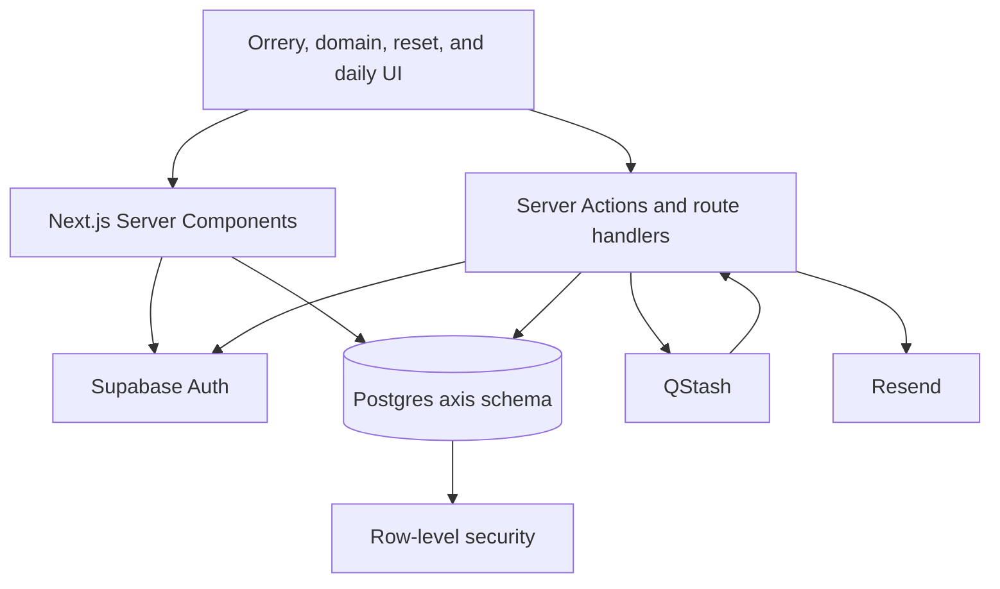
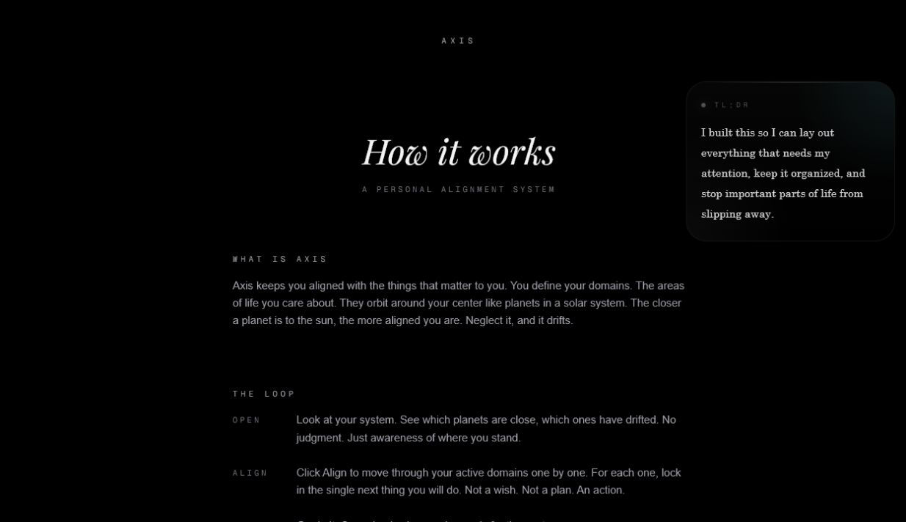

# Axis — product and engineering case study

[Live product](https://axis.yuvrajkashyap.com) · [Repository](https://github.com/YuvrajKashyap/Axis)

## The problem

Task managers are good at storing obligations. They are less good at answering a more human question: **what important part of my life is quietly slipping?**

Axis began as an attempt to make that answer visible without building another feed, streak system, or project-management surface. The product needed to represent several areas of life at once, show neglect without turning it into shame, and finish every session with an action outside the app.

That led to the three-part loop: **Open → Align → Execute**.

## Product principles

### Show state before asking for input

The first screen is not a form or a list. It is a map. Distance, color, motion, and placement make the system readable before the user opens a domain.

### Drift is information, not punishment

A domain can become stale after a configurable period, but the UI treats that as a signal. A new commitment or passive alignment brings it back. Archive is also explicit: some parts of life should be paused without being deleted.

### One next move beats a perfect plan

Domain pages can hold richer context—identity, vision, reason, cost, current reality—but the core interaction remains one concrete commitment. Align-many preserves that focus by sequencing domains rather than presenting a large batch form.

### The product should release attention

There are no feeds, streaks, engagement notifications, or gamified counters. The intended successful session is short.

## Why an orrery

A conventional dashboard would have made implementation easier, but it would have weakened the product thesis. The orrery gives the state model a physical metaphor:

- active domains remain in orbit;
- drifting domains move beyond the core system;
- archived domains stay visible at the edge;
- orbit radius becomes a user-adjustable expression of attention;
- planet motion makes the system feel alive without adding content noise.

The final implementation uses DOM elements and CSS transforms rather than a canvas. That keeps domain labels, links, buttons, keyboard paths, and assistive semantics available to the browser while `requestAnimationFrame` handles continuous motion.

## Core flows

### Public evaluation

An unauthenticated visitor lands on a curated, read-only orrery. This makes the product understandable without sharing credentials or forcing account creation. The demo normally loads from a constrained Supabase RPC; a bundled fallback keeps the visual explanation available during a transient data failure.

### Personal system

After authentication, every domain read and write is scoped to the Supabase user ID. Users can create domains, adjust identity and visual settings, commit a next move, inspect history, and choose whether a domain is aligned, drifting, neutral, or archived.

### Guided alignment

The user can align one domain or choose several in a specific order. The flow carries that order through the URL, commits one action at a time, and returns to the orrery with a visual pulse on the domain that changed.

### Daily execution

Axis later expanded from pure orientation into a Daily surface. Reusable routines contain time blocks and linked checklist items; blocks can have their own colors and subtasks; a user can compare routines and select the one that matches the day. This remains downstream of alignment rather than replacing it.

## System design

### Rendering boundary

Server Components perform user-aware data loading. Client Components own browser-only animation, drag interactions, keyboard commands, modal state, and optimistic UI. Sensitive configuration never crosses into the client bundle unless it is explicitly a public Supabase value.

### Data boundary

The application uses a dedicated `axis` Postgres schema. User-owned rows carry `user_id`, queries scope by that identifier, and RLS policies repeat the ownership constraint at the database layer. Admin demo editing is separately limited to the configured demo user.

### Time-based state

Drift is derived rather than blindly trusted. The computation considers the stored domain state, drift policy, threshold, commitment mode, latest commitment, and passive alignment time. This allows the UI to reflect current reality without a background job continuously rewriting every domain.

### Asynchronous warning safety

When a warning is scheduled, the callback includes the expected warning and activity timestamps. The signed callback verifies QStash, reloads the domain, and sends only if that expected state is still current. A user who realigns before the callback does not receive a stale warning.

## Hard parts

### Motion without losing usability

The orrery has to animate continuously, support direct manipulation, preserve a domain's configured radius, and still behave differently across desktop and mobile. High-frequency values live in refs so animation does not force React rerenders on every frame. Drag state, click thresholds, and navigation are separated so a small movement does not accidentally open a domain.

### A growing settings model

Domains evolved from a simple status and color into independent drift modes, warning windows, commitment requirements, subtask reset policies, time zones, orbit speeds, visual intensities, size scales, and eccentricity. Central normalization keeps older rows and missing fields on safe defaults while SQL migrations remain additive.

### Preserving a simple mental model

Daily routines, subtasks, and warnings add real complexity. The design challenge was keeping that complexity behind the product's original promise. The homepage still answers "what needs attention?" and the primary action is still a concrete next move.

## Visual system

Axis uses near-black space, low-chroma typography, cyan for active state, red for drift, and muted zinc for archive. The visual language is intentionally quiet: the bright points carry state, while labels and orbit lines recede until they are needed.

The explanatory page uses the same register but changes the information density, pairing a serif editorial title with monospaced system labels and restrained body copy.

## Current tradeoffs

- The repository retains Prisma schema tooling from an earlier data-access phase while runtime product queries now use Supabase directly.
- The product has strong compile-time and production-build gates but does not yet have a dedicated automated interaction-test suite.
- Experimental design routes remain in the codebase as a record of interface exploration; robots rules keep them out of search indexing.
- The public demo is intentionally read-only, so deeper mutation flows require an account.

These are explicit constraints rather than hidden claims. The current quality gate is ESLint, TypeScript, Prisma schema validation, a clean Next.js production build, and live browser verification of the public experience.

## Outcome

Axis now ships the complete system it set out to prove: a distinct spatial interface, multi-user persistence, time-derived drift, guided alignment, a daily execution layer, scheduled warning infrastructure, and a public evaluation path that works without credentials.

The strongest part of the project is the consistency between concept and implementation. The orbit metaphor is not decorative; it drives state, navigation, settings, motion, and the product's core decision model.
